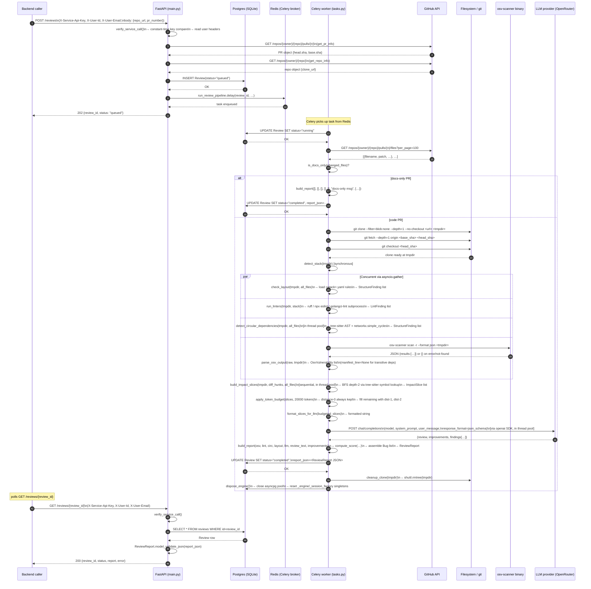

# review-agent — Low-Level Workflow Document

> **Reading this document**: every claim is traced directly from the source files in
> `app/`. File and line citations are in the form `file.py:L<n>`. Where the actual
> code diverges from the original spec, the discrepancy is called out explicitly.

---

## 1. Request-level API Workflow

### Startup (`lifespan` — `app/main.py:L44-L53`)

Before any request is handled, the `lifespan` async context manager runs:
1. Configures `logging.basicConfig` (level INFO, timestamped format).
2. Calls `await init_db()` (`app/db/session.py:L101-L105`), which creates all
   SQLAlchemy-mapped tables if they don't already exist (`Base.metadata.create_all`).
3. Logs the configured port from `get_settings().port`.

---

### `GET /health`  (`app/main.py:L73-L87`)

**Auth**: None. Completely public.

**Lifecycle**:
1. Handler `health()` is called directly — no dependencies, no middleware.
2. Returns `200 OK` with JSON body:
   ```json
   {
     "success": true,
     "data": {
       "status": "ok",
       "service": "review-agent",
       "version": "0.1.0",
       "timestamp": "<ISO-8601 UTC>"
     }
   }
   ```
   `datetime.now(timezone.utc).isoformat()` is computed fresh on each call.

**Failure cases**: None. This endpoint cannot fail unless the process is dead.

---

### `POST /webhook/github`  (`app/main.py:L92-L175`)

**Auth**: HMAC-SHA256 via `X-Hub-Signature-256`. Not protected by `X-Service-Api-Key`.

**Lifecycle** (in exact code order):

1. **Read raw body and headers** (`main.py:L102-L104`):
   - `raw_body = await request.body()` — entire body bytes.
   - `signature = request.headers.get("x-hub-signature-256")` — may be `None`.
   - `event_type = request.headers.get("x-github-event", "")`.

2. **HMAC verification** (`main.py:L109`, calls `verify_github_signature` in
   `app/github/webhook.py:L16-L41`):
   - Checks `signature_header` is not `None` and starts with `"sha256="`.
   - Strips `"sha256="` prefix to get the hex digest.
   - Computes `hmac.new(secret.encode(), raw_body, hashlib.sha256).hexdigest()`.
   - Compares with `hmac.compare_digest` (constant-time).
   - On mismatch or missing header → returns `401` with body
     `{"success": false, "error": "Invalid webhook signature"}`.

3. **JSON parsing** (`main.py:L117-L123`, calls `parse_webhook_payload` in
   `webhook.py:L44-L53`):
   - `json.loads(raw_body.decode("utf-8"))`.
   - On `ValueError` (invalid JSON) → returns `400`
     `{"success": false, "error": "Invalid JSON body"}`.
   - Note: JSON parsing is deliberately deferred until *after* HMAC is verified,
     preventing body-based attacks on the parser.

4. **Ping handling** (`main.py:L126-L130`):
   - If `event_type == "ping"` → returns `200`
     `{"success": true, "handled": true, "message": "pong"}` immediately.
   - No DB write. No Celery enqueue.

5. **Pull-request handling** (`main.py:L132-L169`):
   - Calls `extract_pr_context(payload)` (`webhook.py:L56-L78`):
     - Reads `payload["action"]`. If action is not in `("opened", "reopened",
       "synchronize")` → returns `None`.
     - Otherwise, extracts and returns:
       `action`, `pull_number` (from `pr["number"]`), `head_sha` (from
       `pr["head"]["sha"]`), `base_sha` (from `pr["base"]["sha"]`),
       `clone_url` (from `repo["clone_url"]`), `repo_full_name`
       (from `repo["full_name"]`), `repo_url` (from `repo["html_url"]`).
   - If `extract_pr_context` returns `None` → returns `200`
     `{"success": true, "handled": false, "reason": "ignored_action"}`.
   - Generates `review_id = str(uuid.uuid4())`.
   - **DB write #1**: opens `async with get_session()`, creates and adds a
     `Review` row with:
     - `id=review_id`, `repo_url=pr_ctx["repo_url"]`, `pr_number=pr_ctx["pull_number"]`
     - `user_id="webhook"`, `user_email="webhook@github.com"`, `status="queued"`
     - `report_json=None`, `error=None`
     - Session commits on context-manager exit.
   - Calls `_enqueue_pipeline(...)` (`main.py:L330-L333`):
     - Imports `run_review_pipeline` from `app/tasks.py` (deferred to avoid circular).
     - Calls `run_review_pipeline.delay(...)` with all kwargs.
   - Returns `202 Accepted`
     `{"success": true, "handled": true, "review_id": "<uuid>"}`.

6. **Unsupported events** (`main.py:L172-L175`):
   - Any other `event_type` → `200`
     `{"success": true, "handled": false, "reason": "unsupported_event:<type>"}`.

---

### `POST /reviews`  (`app/main.py:L180-L248`)

**Auth**: `X-Service-Api-Key` + `X-User-Id` + `X-User-Email` (via `verify_service_call`
dependency).

**Middleware executed first — `verify_service_call`** (`app/auth/middleware.py:L45-L92`):

1. Reads `X-Service-Api-Key` via FastAPI's `APIKeyHeader` (auto_error=False, so
   missing key yields `None` rather than an automatic 403).
2. If key is `None` or `secrets.compare_digest(provided_key, settings.service_api_key)`
   is False → raises `HTTP 401`
   `{"success": false, "error": "Missing or invalid X-Service-Api-Key", "code": "SERVICE_KEY_INVALID"}`.
3. Reads `X-User-Id` and `X-User-Email` from headers, strips whitespace.
4. If either is empty → raises `HTTP 400`
   `{"success": false, "error": "Missing required headers...", "code": "USER_HEADERS_MISSING"}`.
5. Reads optional `X-User-Role` header (trusted as-is; backend already checked ACL).
6. Constructs `RequestContext(user_id, user_email, user_role)`, attaches to
   `request.state.ctx`, and returns it.

**Handler `trigger_review`**:

1. FastAPI parses and validates `body` as `TriggerReviewRequest` (Pydantic v2):
   - `repo_url: str` (required)
   - `pr_number: int` (required, `gt=0`)
   - Invalid body → FastAPI returns `422 Unprocessable Entity` automatically.

2. Generates `review_id = str(uuid.uuid4())`.

3. **DB write #1** (`main.py:L201-L210`): opens `get_session()`, creates and adds
   `Review` row with `status="queued"`, `report_json=None`, `error=None`.
   `user_id` and `user_email` come from `ctx` (the `RequestContext`).

4. **GitHub API calls** (`main.py:L213-L222`): imports `GitHubClient` inline.
   Calls `_parse_owner_repo(body.repo_url)` to split into `(owner, repo_name)`:
   - Strips trailing `/`, strips `.git`, splits on `/`, takes last two components.
   - Opens `async with GitHubClient() as gh`:
     - `await gh.get_pr_info(owner, repo_name, body.pr_number)` →
       `GET /repos/{owner}/{repo}/pulls/{pr_number}` with `per_page` not set.
       Returns full PR object. Raises `httpx2.HTTPStatusError` on non-2xx.
     - `await gh.get_repo_info(owner, repo_name)` →
       `GET /repos/{owner}/{repo}`. Returns repo object. Raises on non-2xx.
   - Extracts `clone_url = repo_info["clone_url"]`,
     `head_sha = pr_info["head"]["sha"]`,
     `base_sha = pr_info["base"]["sha"]`.

5. **GitHub failure handling** (`main.py:L223-L233`):
   - Any `Exception` from the GitHub calls is caught.
   - **DB write #2**: opens `get_session()`, fetches `Review` by `review_id`,
     sets `status="failed"`, `error=str(exc)`. Commits.
   - Raises `HTTP 502` with body
     `{"success": false, "error": "Failed to fetch PR info: ...", "code": "GITHUB_API_ERROR"}`.
   - The `Review` row is left in `status="failed"` at this point; no Celery task
     is enqueued.

6. **Celery enqueue** (`main.py:L235-L244`): calls `_enqueue_pipeline(...)` which
   invokes `run_review_pipeline.delay(review_id, repo_url, pr_number, clone_url,
   base_sha, head_sha, user_id, user_email)`.

7. Returns `202 Accepted` with body matching `TriggerReviewResponse`:
   ```json
   { "review_id": "<uuid>", "status": "queued" }
   ```

**Failure modes summary**:

| Condition | Status | Code |
|---|---|---|
| Missing/wrong `X-Service-Api-Key` | 401 | `SERVICE_KEY_INVALID` |
| Missing `X-User-Id` or `X-User-Email` | 400 | `USER_HEADERS_MISSING` |
| Malformed/missing body fields | 422 | (FastAPI default) |
| GitHub API non-2xx | 502 | `GITHUB_API_ERROR` |
| Success | 202 | — |

---

### `GET /reviews/{review_id}`  (`app/main.py:L251-L286`)

**Auth**: `verify_service_call` dependency (same as above).

**Handler `get_review`**:

1. `async with get_session() as session: review = await session.get(Review, review_id)`.
2. If `review` is `None` → raises `HTTP 404`
   `{"success": false, "error": "Review not found", "code": "REVIEW_NOT_FOUND"}`.
3. If `review.report_json` is not `None`:
   - Calls `ReviewReport.model_validate_json(review.report_json)`.
   - If that raises (malformed JSON stored) → silently sets `report = None` (bare
     `except: pass` at `main.py:L278-L279`).
4. Returns `200 OK` matching `ReviewStatusResponse`:
   ```json
   {
     "review_id": "<uuid>",
     "status": "queued|running|completed|failed",
     "report": <ReviewReport or null>,
     "error": "<string or null>"
   }
   ```
   `report` is `null` while status is `queued` or `running`, and also `null` if
   the stored JSON is malformed. `error` is only non-null when `status="failed"`.

---

### `GET /reviews`  (`app/main.py:L289-L325`)

**Auth**: `verify_service_call` dependency.

**Handler `list_reviews`**:

1. `repo: str | None = Query(None)` — optional filter parameter.
2. Builds `stmt = select(Review).order_by(Review.created_at.desc()).limit(50)`.
3. If `repo` is provided: adds `.where(Review.repo_url == repo)` (exact match, no
   LIKE).
4. Executes query; collects `.scalars().all()`.
5. For each `Review` row, if `report_json` is not `None`:
   - `json.loads(r.report_json)` and extracts `.get("score")`.
   - On parse failure → `score = None` (silently).
6. Returns `200 OK` with a JSON array of `ReviewListItem` objects:
   ```json
   [
     {
       "review_id": "<uuid>",
       "repo_url": "<url>",
       "pr_number": <int>,
       "status": "queued|running|completed|failed",
       "score": <int or null>,
       "created_at": "<ISO-8601>"
     }
   ]
   ```
   Hard-capped at 50 items. `score` is `null` for non-completed reviews.

---

## 2. The Celery Pipeline, Step by Step

The Celery task is defined in `app/tasks.py`. The synchronous entry point is
`run_review_pipeline` (`tasks.py:L37-L64`), which immediately calls
`asyncio.run(_run_async(...))`. All actual work happens inside `_run_async`
(`tasks.py:L67-L197`).

**Task registration**:
- Name: `"review_agent.run_review_pipeline"`
- `bind=True` (receives `self` for retry access)
- `max_retries=2`, `default_retry_delay=30`
- `acks_late=True` — message is not acknowledged until the task finishes or crashes

---

### Step 1 — `_run_async` initialisation and DB status update (`tasks.py:L79-L103`)

All imports happen inside `_run_async` (deferred to avoid circular imports at
module load time).

`await init_db()` is called first — this is idempotent (`CREATE TABLE IF NOT EXISTS`).
This call is necessary because the Celery worker process may not share the same
SQLAlchemy engine/session factory as the FastAPI app process.

Then:
```python
async with get_session() as session:
    review = await session.get(Review, review_id)
    if review:
        review.status = "running"
```
**What is written**: sets `Review.status = "running"` for `review_id`. If the row
is missing (e.g. due to a race or DB issue) the `if review:` guard silently skips
the update — the pipeline continues regardless.

---

### Step 2 — GitHub API calls (`tasks.py:L109-L114`)

```python
async with GitHubClient() as gh:
    pr_files = await gh.get_pr_files(*_parse_owner_repo(repo_url), pr_number)
```

- Calls `GET /repos/{owner}/{repo}/pulls/{pr_number}/files?per_page=100`
  (`github/client.py:L49-L52`).
- Returns a list of file objects; each has `filename`, `status`, `additions`,
  `deletions`, and optionally `patch` (unified-diff string).
- **Note**: `get_pr_info` and `get_repo_info` are NOT called in the task —
  they were already called in the `POST /reviews` handler to extract `clone_url`
  and SHAs before enqueueing. In the webhook path, those values come directly from
  the payload.
- `changed_files = [f["filename"] for f in pr_files]` — list of relative paths.
- `GitHubClient` raises `httpx2.HTTPStatusError` on any non-2xx response. This is
  not caught here; it propagates to the `except Exception` at `tasks.py:L181`.

---

### Step 3 — Docs-only pre-check (`tasks.py:L116-L122`, `repo/fetch.py:L123-L144`)

`is_docs_only(changed_files)` iterates over every changed filename:
- For each file, first checks `_is_manifest(f)`: if the file's basename (lowercased)
  is in `_MANIFEST_FILENAMES` or its extension is in `{".csproj", ".vbproj",
  ".fsproj", ".nuspec", ".cabal", ".gemspec"}`, it is **not** docs-only →
  `is_docs_only` returns `False` immediately.
- Then checks each of 12 regex patterns in `_DOCS_ASSET_PATTERNS` (`.md`, `.txt`,
  `.rst`, `.png`, `.jpg/.jpeg`, `.gif`, `.svg`, `.ico`, `.pdf`, `docs/` prefix,
  `.github/` prefix, `CHANGELOG`, `LICENSE`).
- If no pattern matches for a given file → that file is code → returns `False`.
- Returns `True` only if every file matched at least one pattern AND none were manifests.
- Empty list → `False` (treated as code, not docs-only).

**If docs-only** (`tasks.py:L117-L122`):
- Calls `build_report([], [], [], [], [], "This PR contains only documentation...",
  ["No code changes detected — nothing to review."])` directly.
- Calls `await _persist_report(review_id, report)` → sets `status="completed"`,
  `report_json=<json>`.
- Returns `report.model_dump()`. No clone, no analysis, no LLM call.

**If not docs-only**: pipeline continues.

---

### Step 4 — Repo clone (`tasks.py:L125`, `repo/fetch.py:L162-L198`)

`tmpdir = await blobless_clone(clone_url, base_sha, head_sha)`

The function:
1. `tmpdir = tempfile.mkdtemp(prefix="review-agent-clone-")` — creates a temporary
   directory in the OS temp location.
2. **git clone** (step 1 of 3 git commands):
   ```
   git clone --filter=blob:none --depth=1 --no-checkout <clone_url> <tmpdir>
   ```
   `--filter=blob:none` = blobless clone (fetches tree/commit objects but not file
   blobs until needed); `--depth=1` = shallow; `--no-checkout` = no working tree yet.
3. **git fetch** (step 2):
   ```
   git fetch --depth=1 origin <base_sha> <head_sha>
   ```
   Fetches both SHAs explicitly so diffs can be computed.
4. **git checkout** (step 3):
   ```
   git checkout <head_sha>
   ```
   Checks out the head commit into the working tree.

Each git command runs via `asyncio.create_subprocess_exec("git", ...)`. Non-zero
exit raises `RuntimeError(f"git {args[:3]} failed: {stderr}")`.

On any exception, `shutil.rmtree(tmpdir, ignore_errors=True)` cleans up before
re-raising.

`_get_all_files(tmpdir)` (`tasks.py:L25-L34`) then walks `tmpdir` recursively
(`Path.rglob("*")`), returning relative paths for all files whose path parts do
not start with `.git`. This produces `all_files`.

`extract_diff_hunks(pr_files)` (`repo/diff.py:L83-L99`) is also called here,
converting each file's `patch` field into `DiffHunk` objects by parsing unified-diff
hunk headers (`@@ -a,b +c,d @@`) and recording added-line ranges.

---

### Step 5 — Concurrent analysis steps (`tasks.py:L131-L144`)

`detect_stack(tmpdir)` is called **synchronously** (not as a task) first, inspecting
for `pyproject.toml`, `setup.py`, `setup.cfg`, `requirements.txt`, `go.mod`,
`package.json` in that priority order. Returns `"python"`, `"node"`, `"go"`, or
`None`.

Then **four asyncio Tasks** are created and gathered concurrently via
`asyncio.gather`:

#### 5a — Layout check (`_run_layout` → `asyncio.create_task`)
- `tasks.py:L133-L135`, helper at `tasks.py:L209-L212`.
- Calls `check_layout(tmpdir, all_files)` (`structure/checker.py:L56-L122`).
- `detect_stack` is called again inside `check_layout` (redundant but harmless).
- Loads `app/structure/rules/<stack>.yaml` (YAML with `rules` and `forbidden`
  sections). Returns `(findings, stack)`. Only `findings` is kept.
- For **required** rules (where `optional` is not True): if no file in `file_set`
  matches the `path` pattern via `fnmatch`, a `StructureFinding(type="layout")`
  is emitted.
- For **forbidden** paths: if any file matches, a `StructureFinding` is emitted.
- Severity mapping: `"error"→"high"`, `"warning"→"low"`, `"info"→"low"`.
- Returns `list[StructureFinding]`.

#### 5b — Linter (`run_linters` → `asyncio.create_task`)
- `tasks.py:L136`.
- `run_linters(tmpdir, stack)` (`structure/linters.py:L156-L166`) dispatches
  based on stack:
  - `"python"` → `run_ruff(repo_dir)`: spawns `ruff check --output-format json .`
    in `tmpdir`. Parses JSON array. Maps `fix=None → severity="error"`, else
    `"warning"`. Returns `list[LintFinding]`.
  - `"node"` → `run_eslint(repo_dir)`: spawns `npx eslint --format json .`.
    Maps eslint severity codes: `2→"error"`, others→`"warning"`.
  - `"go"` → `run_golangci_lint(repo_dir)`: spawns
    `golangci-lint run --out-format json`.
  - `None` or unknown → logs and returns `[]`.
- All linter runners catch `FileNotFoundError` (binary not in PATH) and return `[]`
  instead of crashing. Other subprocess errors also return `[]` with a warning log.
- Linter exit non-zero is **not** treated as an error — output is always parsed.

#### 5c — Circular dependency detection (`asyncio.to_thread` → `asyncio.create_task`)
- `tasks.py:L137-L139`: wraps `detect_circular_dependencies(tmpdir, all_files)` in
  `asyncio.to_thread` because it is a synchronous (CPU-bound) function.
- `structure/circular_deps.py:L222-L307`:
  - Builds a `networkx.DiGraph`. Nodes = source files; edges = import relationships.
  - Walks all files in `all_files`; `detect_language(filepath)` (from
    `slicing/symbols.py`) filters to `.py`, `.js`, `.jsx`, `.ts`, `.tsx`, `.go` files.
  - For each file, reads its source and runs the appropriate parser:
    - Python: `_parse_python_imports` (tree-sitter `python` with regex fallback)
    - JS/TS: `_parse_js_imports` (tree-sitter `javascript` with regex fallback)
    - Go: `_parse_go_imports` (tree-sitter `go` with regex fallback)
  - Resolves each import specifier to a repo-local file (external packages are
    dropped). Python relative imports are handled. JS only resolves relative
    imports (`.`-prefixed).
  - `nx.simple_cycles(graph)` enumerates all cycles.
  - Returns one `StructureFinding(type="circular_dependency", severity="high")`
    per cycle, with `cycle_path` populated as `["fileA:12 imports fileB", ...]`.
  - On `simple_cycles` failure → logs error, returns `[]`.

#### 5d — OSV scan (`_run_osv` → `asyncio.create_task`)
- `tasks.py:L140`, helper at `tasks.py:L215-L219`.
- Calls `run_osv_scanner(tmpdir)` (`vuln/osv_runner.py:L22-L82`):
  - Spawns: `osv-scanner scan -r --format json <tmpdir>`.
  - `FileNotFoundError` (binary not in PATH) → logs warning, returns `{}` (empty
    dict). Pipeline continues with no vulnerabilities.
  - Any other `Exception` → logs error, returns `{}`.
  - Exit code 128 is treated as "no dependency manifests found" (osv-scanner v2
    `ErrNoPackagesFound`) → returns `{}`.
  - Empty stdout → returns `{}`.
  - Non-zero exit with JSON output is still parsed (osv-scanner exits non-zero
    when vulnerabilities are found).
  - JSON decode failure → logs warning, returns `{}`.
- Calls `parse_osv_output(raw, tmpdir)` (`vuln/osv_parser.py:L138-L201`):
  - Iterates `osv_json["results"]`; for each result reads `source.path`.
  - Strips `repo_dir` prefix from the manifest path via `Path.relative_to(repo_dir)`,
    falling back to using the path as-is if relative_to raises `ValueError`.
  - For each vulnerable package, calls `_find_package_line(manifest_abs, pkg_name,
    pkg_version)`:
    - Reads the manifest file text.
    - Tries three regex patterns (version pinned, JSON-style, Go-style).
    - Falls back to a bare name search.
    - Returns `None` if the package is not directly listed → **this is the
      transitive-dependency case**: the `OsvVulnerability.manifest_line` field
      is `None`, and `_osv_to_bug` passes `None` into `Bug.line_start` and
      `Bug.line_end`.
  - Severity is resolved from `database_specific.severity` (CRITICAL/HIGH/MODERATE/
    MEDIUM/LOW), then from CVSS base score extracted from the score string's
    trailing decimal, then defaults to `"medium"`.

**Concurrency note**: all four tasks (5a, 5b, 5c, 5d) are running simultaneously
via `asyncio.gather`. 5c runs in a thread pool (`to_thread`) because
`detect_circular_dependencies` is synchronous.

---

### Step 5b continued — Impact slicing (`tasks.py:L147-L151`)

**Runs sequentially** after the `asyncio.gather` completes. Not concurrent.

`build_impact_slices(tmpdir, diff_hunks, all_files)` (`slicing/graph.py:L45-L156`):
- For each `DiffHunk`, reads the hunk's file and calls
  `find_enclosing_symbol(source, lang, hunk.line_start, hunk.line_end)`
  (`slicing/symbols.py:L101-L145`):
  - Uses tree-sitter (`tree_sitter_language_pack.get_parser` first, then individual
    packages as fallback) to parse the file.
  - Walks the AST looking for the smallest named symbol (function/class/method)
    that encloses the hunk's line range.
  - Returns `(symbol_name, start_line, end_line)` or `None`.
- If a symbol is found: adds an `ImpactSlice(distance=0)` and enqueues the symbol
  for BFS.
- If no symbol: adds the raw hunk lines as an `ImpactSlice(symbol="<unknown>",
  distance=0)`.
- BFS up to `max_depth=2`: for each queued symbol, searches all repo files for
  identifier occurrences (`\b<name>\b`), finds the enclosing symbol of each match,
  and adds `ImpactSlice(distance=1 or 2)`.

`apply_token_budget(raw_slices, settings.impact_slice_max_tokens)` (`slicing/budget.py:L39-L95`):
- Separates `distance=0` (must-include) from `distance>0` (optional).
- Counts tokens with `tiktoken cl100k_base` encoder; falls back to word-split count
  if tiktoken is unavailable.
- Includes all distance-0 slices unconditionally, then fills remaining budget with
  distance-1, then distance-2, sorted by `(distance ASC, content length DESC)`.
- Default budget: `impact_slice_max_tokens = 20_000`.

`format_slices_for_llm(budgeted_slices)` (`slicing/budget.py:L98-L107`):
- Formats each slice as:
  ```
  # <file>:<start>-<end> (<symbol>, distance=<n>)
  ```
  ```<language>
  <content>
  ```
- Returns joined string.

---

### Step 5e — LLM review (`tasks.py:L154-L165`)

`_format_diff_context(pr_files)` (`tasks.py:L222-L229`):
- Iterates `pr_files`, for each file with a non-empty `patch` field builds:
  ```
  ### <filename>
  ```diff
  <patch>
  ```
  ```
- Joins with `\n\n`.

`LLMReviewClient()` (`review/llm_client.py:L59-L67`):
- Instantiates `openai.OpenAI(api_key=settings.openai_api_key,
  base_url=settings.openrouter_base_url)`.
- Default `openrouter_base_url = "https://openrouter.ai/api/v1"`.
- Default `openai_model = "openai/gpt-5-mini"`.

`llm_client.review(diff_context, slices_text, lint_findings, circular_findings,
diff_file_set)` **runs in a thread** via `asyncio.to_thread` because the OpenAI SDK
is synchronous.

Inside `review()` (`review/llm_client.py:L70-L147`):
1. `_build_lint_summary(lint_findings)`: formats up to 50 lint findings as
   `[SEVERITY] file:line rule: message`. Truncates remainder with a count.
2. `_build_circular_summary(circular_findings, diff_files)`: filters cycles to only
   those where at least one file in `cycle_path` appears in `diff_files` (the set
   of PR-changed files). Only those cycles are included in the prompt.
3. `build_user_message(diff_context, impact_slices, lint_summary, circular_summary)`
   (`review/prompts.py:L108-L143`):
   - Starts with `## Pull Request Diff\n` + diff.
   - Appends `## Impact Context...` section if `impact_slices` is non-empty.
   - Appends `## Lint Findings...` section if `lint_summary` is non-empty.
   - Appends `## Circular Dependency Summary...` if non-empty.
   - Appends `\n\nPlease call the submit_review tool...`.
4. Calls `self._client.chat.completions.create(model=..., max_tokens=4096,
   messages=[system, user], response_format={"type": "json_schema",
   "json_schema": REVIEW_SCHEMA})`.
   - `REVIEW_SCHEMA` is `{"name": "submit_review", "strict": True, "schema": {...}}`
     requiring `review` (string), `improvements` (array of strings), `findings`
     (array of objects with `file`, `line_start`, `line_end`, `severity`,
     `confidence`, `description`, `suggested_fix`).
   - `strict=True` enforces the schema.
5. Extracts `response.choices[0].message.content`.
   - Empty content → returns `("Review could not be completed.", [], [])`.
   - JSON parse failure → returns same.
6. Parses `data["review"]`, `data["improvements"]`, `data["findings"]`.
7. For each finding, constructs `LLMFinding`. Malformed individual findings are
   logged and skipped.
8. Returns `(review_text, improvements, llm_findings)`.

---

### Step 6 — Build report (`tasks.py:L168-L176`, `merge/report.py:L85-L140`)

`build_report(osv_vulns, lint_findings, circular_findings, layout_findings,
llm_findings, review_text, improvements)`:

1. **Score** via `compute_score(...)` (`merge/scorer.py:L23-L87`):
   - Starts at `100.0`.
   - Deducts per OSV vuln: `critical=15, high=10, medium=5, low=2` (from settings).
   - Deducts per lint finding: `error=5, warning=2`.
   - Deducts circular deps: `8 per cycle`, **capped at 24** total deduction.
   - Deducts per LLM finding: `weight × confidence` where
     `critical=12, high=8, medium=4, low=1`.
   - Deducts `3 × len(layout_findings)`.
   - Clamps to `[0, 100]`, rounds, casts to `int`.

2. **Bug list** assembly:
   - Each `LintFinding` → `Bug(source="lint", line_start=f.line, line_end=f.line,
     severity="high" if error else "low")`.
   - Each `OsvVulnerability` → `Bug(source="osv", line_start=v.manifest_line,
     line_end=v.manifest_line, ...)`. **`manifest_line` may be `None`** for
     transitive dependencies (the `None` flows through to `Bug.line_start` and
     `Bug.line_end`).
   - Each circular `StructureFinding` → `Bug(source="circular_dependency",
     cycle_path=f.cycle_path, ...)`.
   - Each layout `StructureFinding` → `Bug(source="structure", line_start=0,
     line_end=0)`.
   - Each `LLMFinding` → `Bug(source="llm", ...)`.
   - Sorted: `critical < high < medium < low`.

3. Returns `ReviewReport(score, review, improvements, bugs)`.

---

### Step 7 — Final DB write (`tasks.py:L178`, `_persist_report` at `tasks.py:L232-L241`)

```python
async with get_session() as session:
    review = await session.get(Review, review_id)
    if review:
        review.status = "completed"
        review.report_json = report.model_dump_json()
```

- `review.status` → `"completed"`.
- `review.report_json` → full JSON string of the `ReviewReport`.

---

### Failure handling (`tasks.py:L181-L188`)

```python
except Exception as exc:
    logger.exception(...)
    async with get_session() as session:
        review = await session.get(Review, review_id)
        if review:
            review.status = "failed"
            review.error = str(exc)
    raise
```

- Any exception after step 1 (the `status="running"` write) is caught here.
- The `Review` row gets `status="failed"`, `error=str(exc)`, `report_json` remains
  `None`.
- The exception is **re-raised**, which causes Celery to retry (up to `max_retries=2`
  with 30s delay) before ultimately marking the task as FAILURE in Redis.
- **Partial results are discarded**: because the exception handler runs before
  `_persist_report`, no intermediate findings (e.g. lint results gathered before
  an OSV crash) are saved. The DB only ever holds a complete report or none at all.

---

### The `finally` block (`tasks.py:L190-L197`)

```python
finally:
    if tmpdir:
        cleanup_clone(tmpdir)
    from app.db.session import dispose_engine
    await dispose_engine()
```

1. `cleanup_clone(tmpdir)` (`repo/fetch.py:L201-L205`):
   `shutil.rmtree(tmpdir, ignore_errors=True)` — removes the cloned repo. Uses
   `ignore_errors=True` so a partial clone doesn't raise. `tmpdir` is `None` if
   the clone step never ran (e.g. docs-only short-circuit), in which case this is
   skipped.

2. `dispose_engine()` (`db/session.py:L69-L85`):
   - Calls `await _engine.dispose()`.
   - Sets global `_engine = None` and `_session_factory = None`.
   - **This is required** because each `asyncio.run()` call creates a new event
     loop. asyncpg connection pools bind themselves to the event loop that was
     active when they were created. Without disposal, the next Celery task's
     `asyncio.run()` starts a fresh event loop but the existing pool is still bound
     to the old (now closed) loop, causing:
     ```
     RuntimeError: Event loop is closed
     ```
     The `dispose_engine` call was added specifically to fix this bug, as documented
     in `db/session.py:L69-L85`'s docstring.

---

## 3. Module Interaction Map

| Module | Imports from | Why |
|---|---|---|
| `app/main.py` | `app/auth/middleware.py` | `verify_service_call` dependency and `RequestContext` type |
| `app/main.py` | `app/config.py` | `get_settings()` for port logging at startup |
| `app/main.py` | `app/db/models.py` | `Review` ORM class for DB operations |
| `app/main.py` | `app/db/session.py` | `get_session`, `init_db` for DB access |
| `app/main.py` | `app/github/webhook.py` | `verify_github_signature`, `parse_webhook_payload`, `extract_pr_context` for webhook handling |
| `app/main.py` | `app/github/client.py` | `GitHubClient` (inline import) to fetch PR/repo info for `POST /reviews` |
| `app/main.py` | `app/models.py` | All Pydantic request/response types (`TriggerReviewRequest`, etc.) |
| `app/main.py` | `app/tasks.py` | `run_review_pipeline` (inline import) to enqueue Celery task |
| `app/tasks.py` | `app/celery_app.py` | `celery_app` decorator to register the task |
| `app/tasks.py` | `app/db/session.py` | `get_session`, `init_db`, `dispose_engine` for DB lifecycle |
| `app/tasks.py` | `app/db/models.py` | `Review` ORM class |
| `app/tasks.py` | `app/github/client.py` | `GitHubClient` to fetch PR file list |
| `app/tasks.py` | `app/repo/fetch.py` | `blobless_clone`, `cleanup_clone`, `is_docs_only` |
| `app/tasks.py` | `app/repo/diff.py` | `extract_diff_hunks` to parse patch into `DiffHunk` objects |
| `app/tasks.py` | `app/slicing/graph.py` | `build_impact_slices` for BFS impact analysis |
| `app/tasks.py` | `app/slicing/budget.py` | `apply_token_budget`, `format_slices_for_llm` |
| `app/tasks.py` | `app/structure/checker.py` | `check_layout`, `detect_stack` |
| `app/tasks.py` | `app/structure/linters.py` | `run_linters` |
| `app/tasks.py` | `app/structure/circular_deps.py` | `detect_circular_dependencies` |
| `app/tasks.py` | `app/vuln/osv_runner.py` | `run_osv_scanner` |
| `app/tasks.py` | `app/vuln/osv_parser.py` | `parse_osv_output` |
| `app/tasks.py` | `app/review/llm_client.py` | `LLMReviewClient` |
| `app/tasks.py` | `app/merge/report.py` | `build_report` |
| `app/tasks.py` | `app/config.py` | `get_settings()` for `impact_slice_max_tokens` |
| `app/auth/middleware.py` | `app/config.py` | `Settings`, `get_settings()` for `service_api_key` |
| `app/celery_app.py` | `app/config.py` | `get_settings()` for `redis_url` |
| `app/db/session.py` | `app/config.py` | `get_settings()` for `database_url` and `environment` |
| `app/db/session.py` | `app/db/models.py` | `Base` for `metadata.create_all` |
| `app/github/client.py` | `app/config.py` | `get_settings()` for `github_app_token` |
| `app/github/webhook.py` | `app/config.py` | `get_settings()` for `github_webhook_secret` |
| `app/repo/diff.py` | `app/models.py` | `DiffHunk` Pydantic model |
| `app/repo/fetch.py` | *(none internal)* | Uses only stdlib (`asyncio`, `shutil`, `tempfile`, `re`, `pathlib`) |
| `app/slicing/graph.py` | `app/models.py` | `DiffHunk`, `ImpactSlice` |
| `app/slicing/graph.py` | `app/slicing/symbols.py` | `detect_language`, `find_enclosing_symbol`, `extract_symbol_body` |
| `app/slicing/budget.py` | `app/models.py` | `ImpactSlice` |
| `app/slicing/symbols.py` | *(none internal)* | Uses only stdlib and optional `tree_sitter_language_pack` |
| `app/structure/checker.py` | `app/models.py` | `StructureFinding` |
| `app/structure/linters.py` | `app/models.py` | `LintFinding` |
| `app/structure/circular_deps.py` | `app/models.py` | `StructureFinding` |
| `app/structure/circular_deps.py` | `app/slicing/symbols.py` | `detect_language` (to filter to supported file types) |
| `app/vuln/osv_runner.py` | *(none internal)* | Uses only stdlib (`asyncio`, `json`) |
| `app/vuln/osv_parser.py` | `app/models.py` | `OsvVulnerability` |
| `app/review/llm_client.py` | `app/config.py` | `get_settings()` for `openai_api_key`, `openrouter_base_url`, `openai_model` |
| `app/review/llm_client.py` | `app/models.py` | `LLMFinding` |
| `app/review/llm_client.py` | `app/review/prompts.py` | `REVIEW_SCHEMA`, `SYSTEM_PROMPT`, `build_user_message` |
| `app/review/prompts.py` | *(none internal)* | Pure data / string functions |
| `app/merge/report.py` | `app/models.py` | All finding types + `Bug`, `ReviewReport` |
| `app/merge/report.py` | `app/merge/scorer.py` | `compute_score` |
| `app/merge/scorer.py` | `app/config.py` | `get_settings()` for scoring weight constants |
| `app/merge/scorer.py` | `app/models.py` | `LintFinding`, `LLMFinding`, `OsvVulnerability`, `StructureFinding` |

---

## 4. Data Model Lifecycle

### `Review` (SQLAlchemy ORM — `app/db/models.py`)

| Field | Type | Set At | Can Be Null? |
|---|---|---|---|
| `id` | `String(36)` UUID | Row creation (API handler) | No |
| `repo_url` | `String(512)` | Row creation | No |
| `pr_number` | `Integer` | Row creation | No |
| `user_id` | `String(256)` | Row creation (`"webhook"` for webhook path) | No |
| `user_email` | `String(256)` | Row creation (`"webhook@github.com"` for webhook) | No |
| `status` | `String(20)` | Row creation `→` task start `→` task end | No |
| `report_json` | `Text` | Set by `_persist_report` on success | Yes — null until `status="completed"` |
| `error` | `Text` | Set on `POST /reviews` GitHub failure OR task exception | Yes — null on success |
| `created_at` | `DateTime` | Row creation | No |
| `updated_at` | `DateTime` | Row creation; auto-updated on any change | No |

**`status` state machine**:
```
queued  →  running  →  completed
                    ↘  failed
```

- `"queued"`: set at row creation in the API handler (both `POST /reviews` and
  `POST /webhook/github`).
- `"running"`: set at the start of `_run_async` in the Celery task.
- `"completed"`: set by `_persist_report` when the full pipeline succeeds.
- `"failed"`: set either (a) in `POST /reviews` if the GitHub API calls fail before
  enqueueing, or (b) in the `except Exception` handler in `_run_async` if any step
  of the pipeline raises.

**`report_json` field**: null from creation until `_persist_report` runs. Once set,
it is the JSON serialization of a `ReviewReport` (produced by
`report.model_dump_json()`).

**`error` field**: null under all non-failure conditions. Set to `str(exc)` on
failure. Not cleared on retry — if the task retries and eventually succeeds, the
error field would remain from the previous attempt (Celery re-uses the same
`review_id`). This is a potential data quality issue not currently addressed.

### `ReviewReport` (Pydantic — `app/models.py:L36-L43`)

| Field | Set by | Can Be Null/Missing? |
|---|---|---|
| `score` | `compute_score(...)` in `build_report` | No — always an integer 0–100 |
| `review` | LLM response `data["review"]` | No — defaults to `"Review completed."` if LLM returned empty |
| `improvements` | LLM response `data["improvements"]` | No — defaults to `[]` |
| `bugs` | Merged from all finding types | No — can be `[]` |

### `Bug` (Pydantic — `app/models.py:L17-L33`)

| Field | Can Be Null? | Real conditions |
|---|---|---|
| `line_start` | Yes — `int \| None` | **OSV transitive dependency**: `_find_package_line` returns `None` when the vulnerable package is not directly listed in the manifest (it's a transitive dep). `None` flows through `OsvVulnerability.manifest_line → _osv_to_bug → Bug.line_start`. |
| `line_end` | Yes — same as above | Same transitive-dependency condition. |
| `suggested_fix` | Yes — `str \| None` | `None` for layout findings (`_layout_to_bug`); `None` for LLM findings where the model returned `null`. |
| `cycle_path` | Yes — `list[str] \| None` | Non-null only for `source="circular_dependency"` bugs. `None` for all other sources. |

The OSV transitive-dependency `None` case is explicitly documented in
`osv_parser.py:L182-L185` and `models.py:L21-L22`.

---

## 5. External Dependencies and Failure Behavior

### GitHub API (via `app/github/client.py`)

**Where called**:
- `POST /reviews` handler: `get_pr_info` and `get_repo_info` to extract
  `clone_url`, `head_sha`, `base_sha`. Synchronous point — request blocks here.
- Celery task (`_run_async`): `get_pr_files` to get the changed-files list with
  patch data.

**On failure**:
- `httpx2.HTTPStatusError` is raised on non-2xx (`response.raise_for_status()`).
- In `POST /reviews`: caught by `except Exception`; DB row set to `failed`;
  returns HTTP 502. **Gracefully handled**.
- In Celery task: not caught locally; propagates to `except Exception` at
  `tasks.py:L181`; DB row set to `failed`; exception re-raised for Celery retry.
  After `max_retries=2`, Celery marks task as FAILURE. **Gracefully handled —
  task is retried**.
- Network timeout: `_TIMEOUT = httpx2.Timeout(30.0)` — raises `httpx2.TimeoutException`
  after 30s, which is an `Exception` and is handled by the same paths above.

### Redis (Celery broker/backend — `app/celery_app.py`)

**Where called**:
- `run_review_pipeline.delay(...)` in `_enqueue_pipeline` — when the API handler
  tries to push the task to the queue.
- Celery worker reads from Redis queue to pick up tasks.
- Task results are stored back to Redis (`backend=settings.redis_url`).

**On failure**:
- If Redis is unavailable when `delay()` is called: the `kombu` library (Celery's
  transport) raises a connection error. **This is not caught** in `_enqueue_pipeline`
  or in the API handlers. The `POST /reviews` handler would crash with a 500 Internal
  Server Error. **Unhandled — surfaces as HTTP 500**.
- If Redis becomes unavailable mid-task: Celery retries delivery based on broker
  configuration. The task itself is not affected until it tries to ack the message.

### Postgres / SQLite (via `app/db/session.py`)

**Where called**:
- Every API endpoint and every DB-touching step in the Celery task.

**On failure**:
- `get_session()` context manager calls `session.rollback()` on exception and
  re-raises.
- If the DB is unavailable at `init_db()` (startup or task start): `create_all`
  raises. In the API app this would crash startup; in the task it propagates to
  the `except Exception` handler — but if the DB is unavailable, the handler's
  own DB write also fails, so the row is never updated. **Partially unhandled —
  task enters Celery FAILURE state but `Review.status` stays `"running"`**.
- SQLAlchemy async pool: `pool_pre_ping=True` ensures stale connections are
  detected and recycled. The `dispose_engine` call in `finally` prevents the
  event-loop-closed bug.

### OpenRouter / OpenAI LLM (via `app/review/llm_client.py`)

**Where called**:
- Inside `LLMReviewClient.review()`, called via `asyncio.to_thread` in `_run_async`.

**On failure**:
- `openai.OpenAI.chat.completions.create(...)` raises `openai.APIError` subclasses
  on non-2xx, timeout, or network error.
- **Not caught inside `review()`**. The `openai` library exception propagates out
  of `asyncio.to_thread`, then out of `await asyncio.to_thread(llm_client.review, ...)`
  in `_run_async`.
- Caught by the outer `except Exception` at `tasks.py:L181` → `status="failed"`.
  Task is retried by Celery up to 2 times. **Graceful at task level, unhandled at
  `review()` function level**.
- Empty LLM response (`content = None` or `content = ""`): caught inside `review()`
  at `llm_client.py:L112-L114`, returns `("Review could not be completed.", [], [])`.
  Pipeline continues; `build_report` gets empty LLM results. **Gracefully degraded**.
- JSON parse failure of LLM response: caught at `llm_client.py:L119-L121`, same
  graceful degradation. **Handled**.

### `osv-scanner` binary (via `app/vuln/osv_runner.py`)

**Where called**:
- `run_osv_scanner(tmpdir)` in `_run_osv`, run as a concurrent asyncio task.

**On failure**:
- `FileNotFoundError` (binary not in PATH): caught at `osv_runner.py:L42-L44`,
  logs warning, returns `{}`. `parse_osv_output({}, ...)` returns `[]`. Pipeline
  continues without vulnerability data. **Gracefully handled — silently skipped**.
- Other subprocess exceptions: caught at `osv_runner.py:L45-L47`, returns `{}`.
  **Handled**.
- Exit code 128 (`ErrNoPackagesFound`): explicitly handled, returns `{}`.
  **Handled**.
- Non-zero exit with JSON: parsed normally — this is the expected path when vulns
  are found. **Handled**.
- JSON decode failure of stdout: logged as warning, returns `{}`. **Handled**.

### `git` binary (via `app/repo/fetch.py`)

**Where called**:
- `blobless_clone(clone_url, base_sha, head_sha)` in `_run_async`.

**On failure**:
- `asyncio.create_subprocess_exec("git", ...)` raises `FileNotFoundError` if `git`
  is not in PATH. **Not caught** in `_run_git`. Propagates to `blobless_clone`'s
  `except Exception` block, which calls `shutil.rmtree(tmpdir)` and re-raises.
  Then caught by `_run_async`'s outer `except Exception` → `status="failed"`.
  **Graceful at task level, but git being missing would be a deployment error**.
- Non-zero git exit (e.g. auth failure on private repo, SHA not found): `_run_git`
  raises `RuntimeError(f"git {args[:3]} failed: {stderr}")`. Same propagation path.
  **Handled at task level**.
- Network failure mid-clone: git exits non-zero; same path. **Handled at task level**.

### Linters (`ruff`, `npx eslint`, `golangci-lint`)

**Where called**:
- `run_linters(tmpdir, stack)` in the concurrent asyncio gather.

**On failure**:
- `FileNotFoundError` for any linter binary: caught by `_run_subprocess` at
  `linters.py:L35-L37`, returns `(-1, "", ...)`. The caller checks `if rc == -1:
  return []`. **Gracefully returns empty — pipeline continues without lint results**.
- Any other subprocess exception: caught at `linters.py:L38-L40`, returns `(-1,
  "", ...)`. Same result. **Handled**.
- Linter produces invalid JSON: caught and logged as warning; returns `[]`.
  **Handled**.

---

## 6. Full Sequence Diagram



---

*Document generated by tracing all source files in `app/` as of the current commit.
Covers `main.py` (339 lines), `tasks.py` (241 lines), `auth/middleware.py` (93),
`db/models.py` (58), `db/session.py` (106), `config.py` (81), `celery_app.py` (37),
`github/client.py` (76), `github/webhook.py` (79), `repo/fetch.py` (206),
`repo/diff.py` (100), `slicing/graph.py` (157), `slicing/budget.py` (108),
`slicing/symbols.py` (155), `structure/checker.py` (128), `structure/linters.py`
(167), `structure/circular_deps.py` (308), `vuln/osv_runner.py` (83),
`vuln/osv_parser.py` (202), `review/llm_client.py` (148), `review/prompts.py`
(144), `merge/report.py` (141), `merge/scorer.py` (88), `models.py` (142).*
